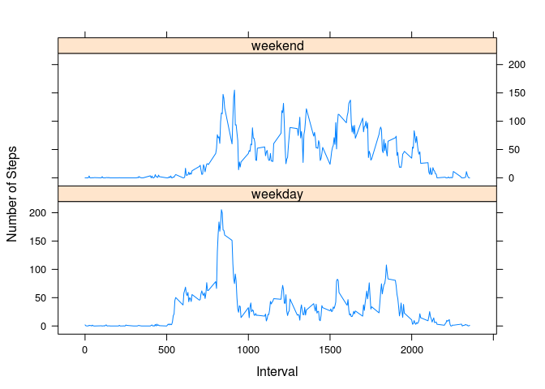

# Reproducible Research: Peer Assessment 1


###Loading and preprocessing the data

```r
activity_data <- read.csv(unz('activity.zip', 'activity.csv'))

# check the data's structure
str(activity_data)
```

```
## 'data.frame':	17568 obs. of  3 variables:
##  $ steps   : int  NA NA NA NA NA NA NA NA NA NA ...
##  $ date    : Factor w/ 61 levels "2012-10-01","2012-10-02",..: 1 1 1 1 1 1 1 1 1 1 ...
##  $ interval: int  0 5 10 15 20 25 30 35 40 45 ...
```

```r
# see some data
tail(activity_data)
```

```
##       steps       date interval
## 17563    NA 2012-11-30     2330
## 17564    NA 2012-11-30     2335
## 17565    NA 2012-11-30     2340
## 17566    NA 2012-11-30     2345
## 17567    NA 2012-11-30     2350
## 17568    NA 2012-11-30     2355
```


###What is mean total number of steps taken per day?


For this part of the assignment, you can ignore the missing values in the dataset.


#####1. Make a histogram of the total number of steps taken each day


```r
with(na.omit(activity_data), hist(rowsum(steps, date), main='Total Steps In A Day', xlab='Number of Steps'))
```

 


#####2. Calculate and report the mean and median total number of steps taken per day


```r
# calculate in 2 ways for comparison: summary stats, ..
with(na.omit(activity_data), summary(rowsum(steps, date)))
```

```
##        V1       
##  Min.   :   41  
##  1st Qu.: 8841  
##  Median :10765  
##  Mean   :10766  
##  3rd Qu.:13294  
##  Max.   :21194
```

```r
# ...and manual calculation
steps_mean <- with(na.omit(activity_data), mean(rowsum(steps, date)))
steps_mean
```

```
## [1] 10766.19
```

```r
steps_median <- with(na.omit(activity_data), median(rowsum(steps, date)))
steps_median
```

```
## [1] 10765
```

**mean** = 10766.19

**median** = 10765


###What is the average daily activity pattern?


#####1. Make a time series plot (i.e. type = "l") of the 5-minute interval (x-axis) and the average number of steps taken, averaged across all days (y-axis)


```r
interval_meansteps <- with(na.omit(activity_data), aggregate(steps, list(interval), mean))
names(interval_meansteps) <- c('interval', 'mean_steps')
head(interval_meansteps)
```

```
##   interval mean_steps
## 1        0  1.7169811
## 2        5  0.3396226
## 3       10  0.1320755
## 4       15  0.1509434
## 5       20  0.0754717
## 6       25  2.0943396
```

```r
with(interval_meansteps, plot(mean_steps ~ interval, type='l', xlab='Interval', ylab='Average No of Steps'))
```

 


#####2. Which 5-minute interval, on average across all the days in the dataset, contains the maximum number of steps?


```r
interval_meansteps[which.max(interval_meansteps[,2]),]
```

```
##     interval mean_steps
## 104      835   206.1698
```


###Imputing missing values


#####1. Calculate and report the total number of missing values in the dataset (i.e. the total number of rows with NAs)

```r
nrow(activity_data[is.na(activity_data$steps),])
```

```
## [1] 2304
```


#####2. Devise a strategy for filling in all of the missing values in the dataset. The strategy does not need to be sophisticated. For example, you could use the mean/median for that day, or the mean for that 5-minute interval, etc.


Let's fill up with the missing values with **median** in that 5-min interval.


#####3. Create a new dataset that is equal to the original dataset but with the missing data filled in.


```r
activity_data_filled <- activity_data
activity_data_filled$steps[is.na(activity_data_filled$steps)] <- with(activity_data_filled, ave(steps, interval, 
   FUN = function(x) median(x, na.rm = TRUE)))[is.na(activity_data_filled$steps)]

# see the result
head(activity_data)
```

```
##   steps       date interval
## 1    NA 2012-10-01        0
## 2    NA 2012-10-01        5
## 3    NA 2012-10-01       10
## 4    NA 2012-10-01       15
## 5    NA 2012-10-01       20
## 6    NA 2012-10-01       25
```

```r
head(activity_data_filled)
```

```
##   steps       date interval
## 1     0 2012-10-01        0
## 2     0 2012-10-01        5
## 3     0 2012-10-01       10
## 4     0 2012-10-01       15
## 5     0 2012-10-01       20
## 6     0 2012-10-01       25
```


#####4.Make a histogram of the total number of steps taken each day and Calculate and report the mean and median total number of steps taken per day. Do these values differ from the estimates from the first part of the assignment? What is the impact of imputing missing data on the estimates of the total daily number of steps?


```r
with(activity_data_filled, hist(rowsum(steps, date), main='Total Steps In A Day (NA replaced with Median)', xlab='Number of Steps'))
```

 


As we can see in the histogram above, imputing missing values with the median for the 5-min interval, increases the frequency on the lower end spectrum of number of steps. Consequently, this increase lowers the summary statistics values as confirmed by the table below.


```r
with(activity_data_filled, summary(rowsum(steps, date)))
```

```
##        V1       
##  Min.   :   41  
##  1st Qu.: 6778  
##  Median :10395  
##  Mean   : 9504  
##  3rd Qu.:12811  
##  Max.   :21194
```


###Are there differences in activity patterns between weekdays and weekends?


#####1. Create a new factor variable in the dataset with two levels – “weekday” and “weekend” indicating whether a given date is a weekday or weekend day.


```r
activity_data_filled$day <- as.factor(ifelse(weekdays(as.Date(activity_data_filled$date)) %in% c('Saturday', 'Sunday'),'weekend','weekday'))
str(activity_data_filled)
```

```
## 'data.frame':	17568 obs. of  4 variables:
##  $ steps   : int  0 0 0 0 0 0 0 0 0 0 ...
##  $ date    : Factor w/ 61 levels "2012-10-01","2012-10-02",..: 1 1 1 1 1 1 1 1 1 1 ...
##  $ interval: int  0 5 10 15 20 25 30 35 40 45 ...
##  $ day     : Factor w/ 2 levels "weekday","weekend": 1 1 1 1 1 1 1 1 1 1 ...
```


#####2. Make a panel plot containing a time series plot (i.e. type = "l") of the 5-minute interval (x-axis) and the average number of steps taken, averaged across all weekday days or weekend days (y-axis). See the README file in the GitHub repository to see an example of what this plot should look like using simulated data.


```r
# create the data frame
interval_day_mean <- with(activity_data_filled, aggregate(steps, list(interval, day), mean))
names(interval_day_mean) <- c('interval', 'day', 'meansteps')

# see the new data frame
str(interval_day_mean)
```

```
## 'data.frame':	576 obs. of  3 variables:
##  $ interval : int  0 5 10 15 20 25 30 35 40 45 ...
##  $ day      : Factor w/ 2 levels "weekday","weekend": 1 1 1 1 1 1 1 1 1 1 ...
##  $ meansteps: num  2.0222 0.4 0.1556 0.1778 0.0889 ...
```

```r
# see the data
head(interval_day_mean)
```

```
##   interval     day  meansteps
## 1        0 weekday 2.02222222
## 2        5 weekday 0.40000000
## 3       10 weekday 0.15555556
## 4       15 weekday 0.17777778
## 5       20 weekday 0.08888889
## 6       25 weekday 1.31111111
```

```r
# plot the data
library(lattice)
xyplot(meansteps ~ interval | day, data=interval_day_mean , type='l', layout=c(1,2), xlab='Interval', ylab='Number of Steps')
```

 


